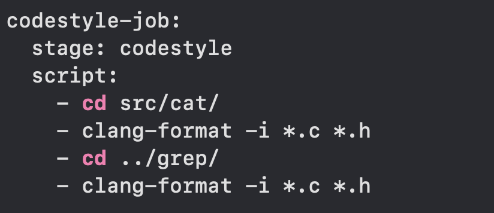

# Basic CI/CD

## Part 1. Setting up the gitlab-runner

I started Ubuntu Server on Virtual machine:
* 

then I installed and rigestered gitlab-runner. I used these commands:
 - sudo apt-get install gitlab-runner
 - sudo gitlab-runner register (here put url and registration token of the project and chose shell executer)
 
## Part 2. Building

I created .gitlab-ci.yml file in the root of the project then wrote a stage to start building with a 30-day retention day artifacts
* 

## Part 3. Codestyle test

A stage for CI that runs a codestyle script:
* 

## Part 4. Integration tests

The stage that runs my integration on condition the stages build and code style test passing successfully:
* 

Output after successful testing:
* 

## Part 5. Deployment stage

I ran a second virtual machine
* 

I connected first and second virtual machine with a static route, then I checked a connection between them and set ssh for transfering:
 - sudo -u gitlab-runner ssh-keygen (generate ssh key)
 - ssh-copy-id convictw@10.10.0.100 (it copies my public key to the remote server's ~/.ssh/authorized_keys file, allowing me to authenticate using my private key instead of a password)

A bash script which copies the files received after the building (artifacts) into the /usr/local/bin directory of the second virtual machine using ssh and scp: 
* 

Added a manual stage in the gitlab-ci.yml file to run the script:
* 

## Part 6. Bonus. Notifications

Created bot on telegram using BotFather to get telegram bot token
* 

Script for running telegram bot:
* 

Added a new stage "notification" to the .gitlab-ci.yml file
* 

The final version of my pipline:
* 

Notification of success
* 

Notification of fail
* 
