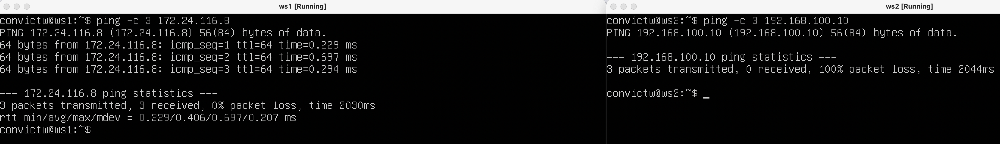
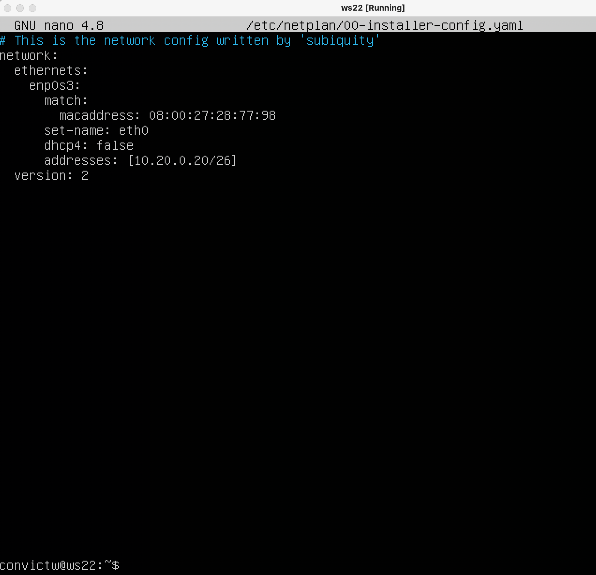
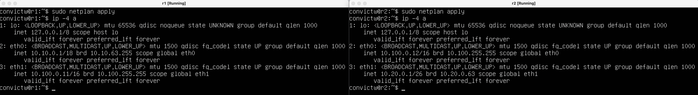
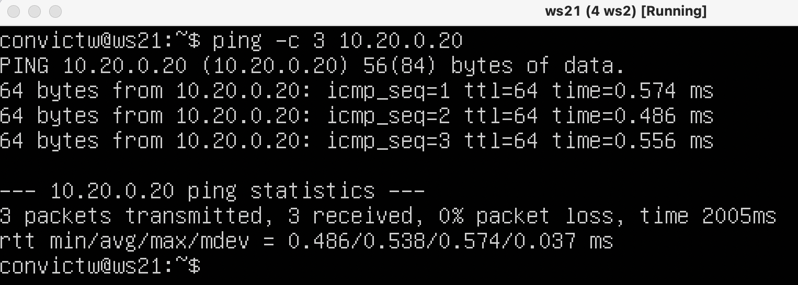
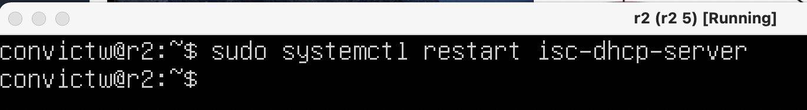
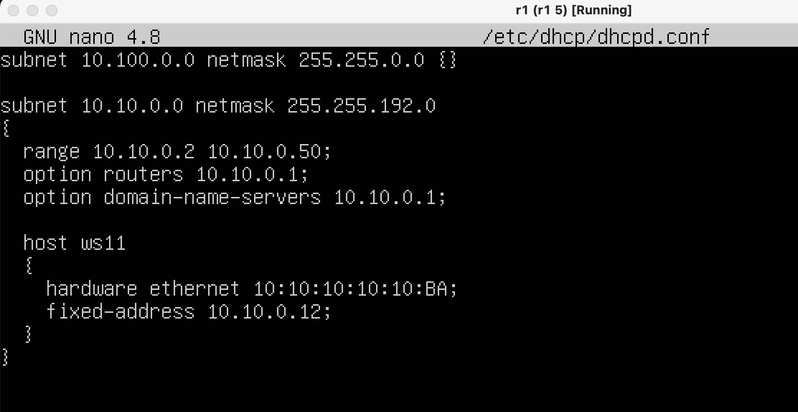

# Linux Network

## Part 1. ipcalc tool

### 1.1. Networks and Masks

    - 1) network address of 192.167.38.54/13 is 
    mask : 11111111.11111000.00000000.0000000 = 255.248.000.000
    network address is 192.167.38.54 && 255.248.000.000 = 192.160.000.000
    - 2) 255.255.255.0 - prefix is /24, binary is 11111111.11111111.11111111.00000000
        /15 - normal is 255.254.000.000, binary is 11111111.11111110.00000000.00000000
        11111111.11111111.11111111.11110000 - normal is 255.255.255.240, prefix is /28
    - 3) minimum and maximum host in 12.167.38.4 network with masks:
        /8: 12.0.0.1 - 12.255.255.254
        /16: 12.167.0.1 - 12.167.255.254
        /23: 12.167.38.1 - 12.167.38.254
        /4: 0.0.0.1 - 15.255.255.254

### 1.2. localhost

    - 194.34.23.100 - not a localhost
    - 127.0.0.2 - it's a localhost, yes
    - 127.1.0.1 - it's a localhost, yes
    - 128.0.0.1 - not a localhost. 
         
### 1.3 Network ranges and segments

   - 1) Private: 10.0.0.45, 10.10.10.10, 172.16.255.255, 172.20.250.4, 192.168.4.2
    Public: 134.43.0.2, , 172.0.2.1, 192.172.0.1, 172.68.0.2, , 192.169.168.1
    - 2) May be gateways of IP 10.10.0.0/18: 10.10.0.2, 10.10.10.10, 10.10.1.255

## Part 2. Static routing between two machines

* 

* 

* 

### 2.1. Adding a static route manually

* 

* 

### 2.2. Adding a static route with saving

* 

* 

## Part 3. iperf3 utility

### 3.1 Connection speed

    - 8 Mbps = 1 MB/s
    - 100 MB/s = 800 000 Kbps
    - 1 Gbps = 125 Mbps
    
### 3.2. iperf3 utility

* 
* 

## Part 4. Network firewall

### 4.1. iptables utility

* 

* 

* iptables прекращает обработку, как только находит совпадение, поэтому в ws1 будет запрещен вывод echo-reply, а в ws2 - разрешен

### 4.2. nmap utility

* 

* 

            
## Part 5. Static network routing

### 5.1. Configuration of machine addresses

* ws11 and ws21 configuration
* 

* ws22 configuration
* 

* r1 and r2 configuration
* 

* ip: ws11 and ws21
* 

* ip: ws22
* 

* ip: r1 and r2
* 

* ping ws22 from ws21
* 

* ping r1 from ws11
* 

### 5.2. Enabling IP forwarding

* 
* 

### 5.3. Default route configuration

* ws11 ws21
* 

* ws22
* 

* ws11 ws21
* 

* ws22
* 

* Ping r2 router from ws11 + tcpdump -tn -i eth0
* 

### 5.4. Adding static routes

* static routes for r1 and r2
* 

* ip: r1 and r2
* 

* 

* Если к сети существует несколько маршрутов, то выбирается более точный маршрут, по правилу длиннейшего префикса - 10.10.0.0/18 нежели 0.0.0.0/0, 18 > 0.

### 5.5. Making a router list

* using traceroute and tcpdump:
* 

*    
    - Начало пути: Трассировочный маршрут начинается с ws11 и отправляет пакет эхо-запроса протокола управления интернет-сообщениями (ICMP) на 10.20.0.10 (пункт назначения). Поле IP TTL (Time To Live) в заголовке пакета изначально установлено равным 1.
    - Первый переход: пакет достигает первого маршрутизатора r1, который уменьшает значение TTL на 1 и перенаправляет пакет на следующий переход. Если TTL достигает нуля во время передачи, пакет отбрасывается, и сообщение о превышении времени ICMP отправляется обратно отправителю.
    - Последующие переходы: Этот процесс продолжается, при этом пакет достигает каждого последующего маршрутизатора (r2), TTL уменьшается, и пакет пересылается на следующий переход.
    - Конец пути: Когда пакет достигает ws22, ws22 отправляет пакет эхо-ответа ICMP обратно в ws11. На этом путь от ws11 к ws22 завершается.
    - Формирование отчета: Команда traceroute сообщает о пройденном пути, показывая каждый переход по пути и время, затраченное пакетом на прохождение от одного перехода к следующему. Это дает визуальное представление сетевого пути от источника к месту назначения

### 5.6. Using ICMP protocol in routing

* 

## Part 6. Dynamic IP configuration using DHCP

* dhcp setting of r2
* 

* dns setting of r2
* 

* 

* ws21 ip before dhcp setting
* 

* ws21 ip after dhcp setting
* 

* pinging ws22 from ws21
* 

* dhcp setting of r1
* 

* dns setting of r1
* 

* 

* ws11 ip before dhcp setting
* 

* ws11 ip after dhcp setting
* 

* pinging ws22 from ws11
* 

* Request ip address update from ws21

* 

* 

*  
    - Параметр DHCP 1: маска подсети, которая будет применена к интерфейсу, запрашивающему IP-адрес
    - Параметр DHCP 3: маршрутизатор по умолчанию или шлюз последней инстанции для этого интерфейса
    - Параметр DHCP 6: какой DNS (сервер доменных имен) включить в конфигурацию IP для разрешения имен
    - Параметр DHCP 51: время аренды для этого IP-адреса

## Part 7. NAT

* 

* 

* 

* till changes in the firewall a can't ping ws22 from r1
* 

* making changes
* 

* success pinging ws22 from r1
* 

* enabling SNAT and DNAT
* 

* 

* 

## Part 8. Bonus. Introduction to SSH Tunnels

* firewall for r2
* 
 
* 

* Start the Apapche web server
* 

* Local TCP forwarding from w21 to ws22
* 

* Remote TCP forwarding from w11 to ws22
* 

* Connecting to server from ws21
* 

* Connecting to server from ws11
* 
