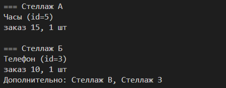

# SQlite3Utility

Это небольшой проект на языке C, который представляет собой утилиту для вывода информации о товарах в интернет-магазине электронных приборов. Проект работает с базой данных SQLite3 и предоставляет возможность просмотра информации о городах (на стадии реализации), клиентах (на стадии реализации), типах устройств, продуктах, складах, расположении продуктов, заказах и их деталях.

## Требования

Для запуска этой утилиты необходимо иметь следующее программное обеспечение:

- GCC (GNU Compiler Collection)
- Makefile
- SQLite3

## Установка и запуск

1. Клонируйте репозиторий на свой локальный компьютер:

        git clone https://github.com/your_username/warehouse_search.git

2. Перейдите в директорию проекта:

        cd warehouse_search

3. Выполните сборку проекта с помощью команды make build:

        make build

4. Для запуска программы с начальными данными выполните команду make run:

        make run

Программа будет запущена с параметрами 10 11 14 15, которые могут быть изменены на любое количество символов.

Пример вывода:

## Структура базы данных

В проекте представлены следующие таблицы в базе данных:

- city
- customer
- device_type
- product
- warehouse
- product_location
- orders
- order_details
- order_stage
- order_progress

Дополнительную информацию о структуре базы данных можно найти в файле load_data.sql.