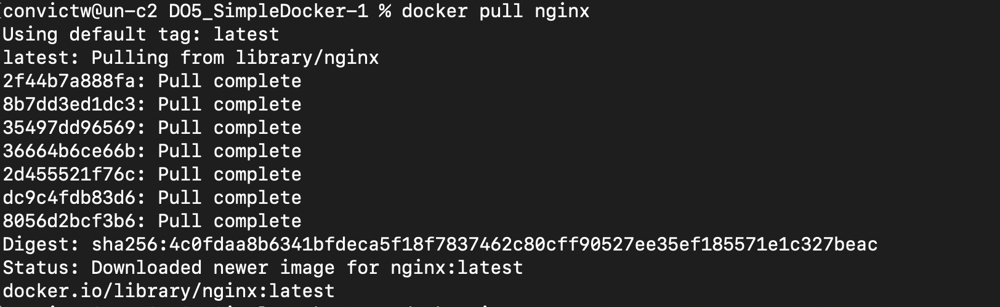
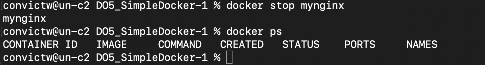
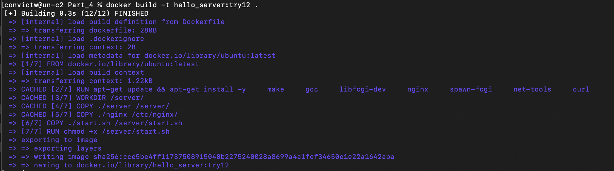
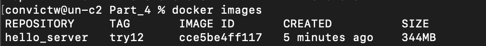

# Simple Docker

## Part 1. Ready-made docker

Pulling nginx image:
* 

* 

* 

* 

* docker inspect:
  - container size: "SizeRw": 1095 byte
                    "SizeRootFs": 186729412 byte
  - list of mapped ports
                80/tcp:
                        "HostIp": "0.0.0.0",
                        "HostPort": "8080"

  - container ip: IPAddress: 172.17.0.2

* 

* 

Connection to nginx:
* 

* 

## Part 2. Operations with container

* 

I created nginx.conf file in Part_2 directory and add 

* 

Changing the nginx configurations:
* 

* 

* 

Saving the container as a .tar file
* 

* 

* 

* 

* 

* 

Checkcing the connection:
* 

## Part 3. Mini web server

* I started virtual machine, and installed next utilitues:
    - apt-get install libfcgi-dev
    - apt-get install spawn-fcgi
    - apt-get install nginx
  
* I ran web server with and without socket. All types of mini server is in the server folder 

* result:
* 

## Part 4. Your own docker

* I created Dockerfile and copied /nginx folder to the Part_4 directory and build a docker image:

* 

* 

* 

*  localhost:80:
* 

*  after restarting: localhost:80/status:
* 

## Part 5. Dockle

* dockle before correction of Dockerfile:
* 

* dockle after correction of Dockerfile, but I need use --accept-key NGINX_GPGKEY to ignore the NGINX_GPGKEY environment variable, because it is empty:
* 

## Part 6. Basic Docker Compose

* I created nginx container builder in Part 6 directory
*I wrote a docker-compose.yml file and run docker-compose build:
* 

* 

* proccess of server running
* 

* I got "hello, world!" in the browser page. It is a success!
* 