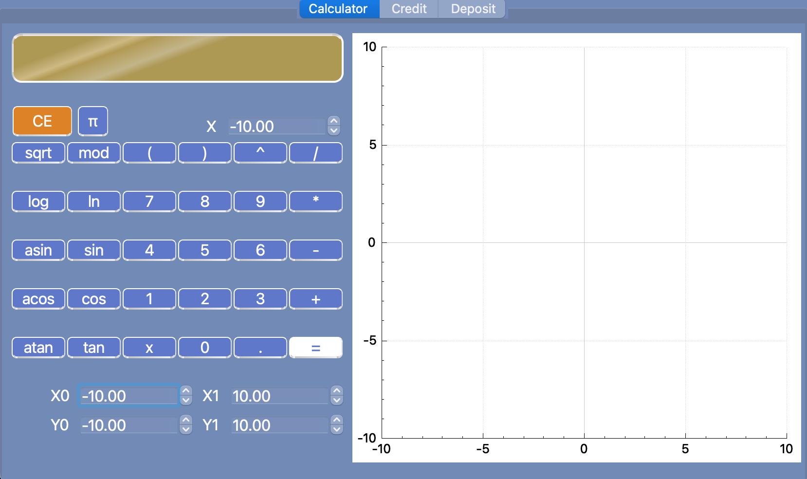
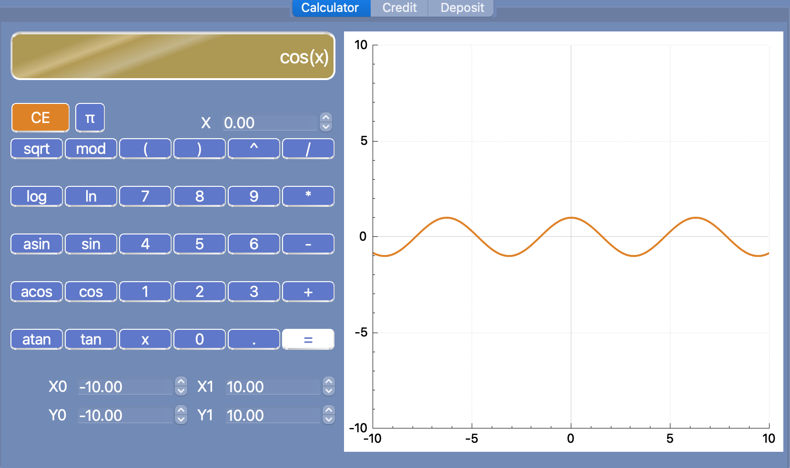
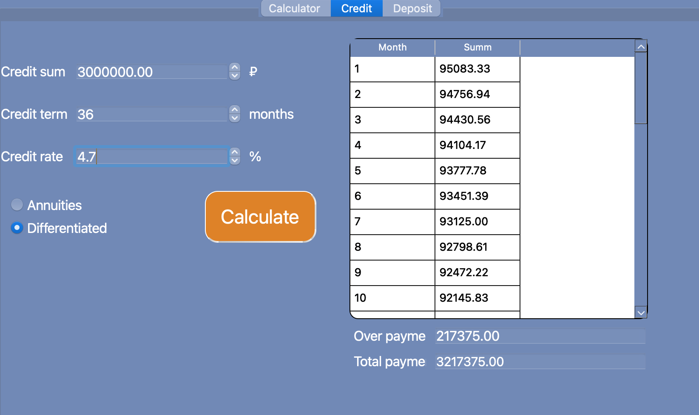
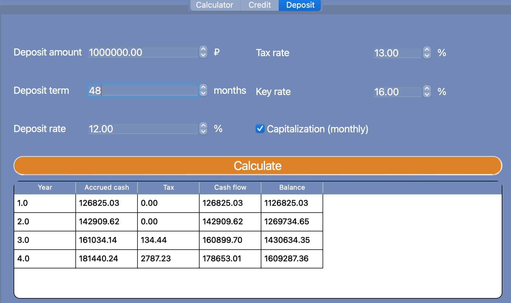

# SmartCalc Documentation

## Installation
To use this calculator, the user needs to install the following utilities:
- `gcc`
- `make`
- `qmake`

## Development Details
- The calculator has been developed using the C/C++  programming language using gcc compiler and the QT Creator version 6.2.
- The program is built with Makefile which contains standard set of targets for GNU-programs: all, install, uninstall, clean, dvi, dist, test, gcov_report.
- The calculation is done after you complete entering the calculating expression and press the = symbol or press "Enter" putton.
- Users are able to enter up to 255 characters


## Installation Command
To install the calculator, please run the following command:
```
make install
```

## Arithmetic Operations
The calculator supports the following arithmetic operations:

| Operator name | Infix notation <br /> (Classic) | Prefix notation <br /> (Polish notation) | Postfix notation <br /> (Reverse Polish notation) |
| --------- | ------ | ------ | ------ |
| Brackets | (a + b) | (+ a b) | a b + |
| Addition | a + b | + a b | a b + |
| Subtraction | a - b | - a b | a b - |
| Multiplication | a * b | * a b | a b * |
| Division | a / b | / a b | a b \ |
| Power | a ^ b | ^ a b | a b ^ |
| Modulus | a mod b | mod a b | a b mod |
| Unary plus | +a | +a | a+ |
| Unary minus | -a | -a | a- |


## Mathematical Functions
The calculator includes various mathematical functions, including:
  
| Function description | Function |
| -------------------- | -------- |
| Computes cosine    | cos(x)  |
| Computes sine      | sin(x)  |
| Computes tangent   | tan(x)  |
| Computes arc cosine | acos(x) |
| Computes arc sine  | asin(x) |
| Computes arc tangent| atan(x) |
| Computes square root| sqrt(x) |
| Computes natural logarithm| ln(x)|
| Computes common logarithm| log(x)|



    The interface of the SmartCalc

## Function Plotting
The calculator provides the ability to plot functions. You can visualize mathematical equations easily.



    Cos(x) plotting

## Special Modes of Operation
The calculator has two special modes of operation:
### Credit Calculator 
Useful for calculating credit payments.



    The interface of the credit calculator

- Input: total credit amount, term, interest rate, type (annuity, differentiated)
- Output: monthly payment, overpayment on credit, total payment

### Deposit Calculator 
Handy for calculating deposit interests.



    The interface of the deposit calculator

- Input: deposit amount, deposit term, interest rate, tax rate, key rate, capitalization of interest
- Output: accrued interest, tax amount, deposit amount by the end of the term
