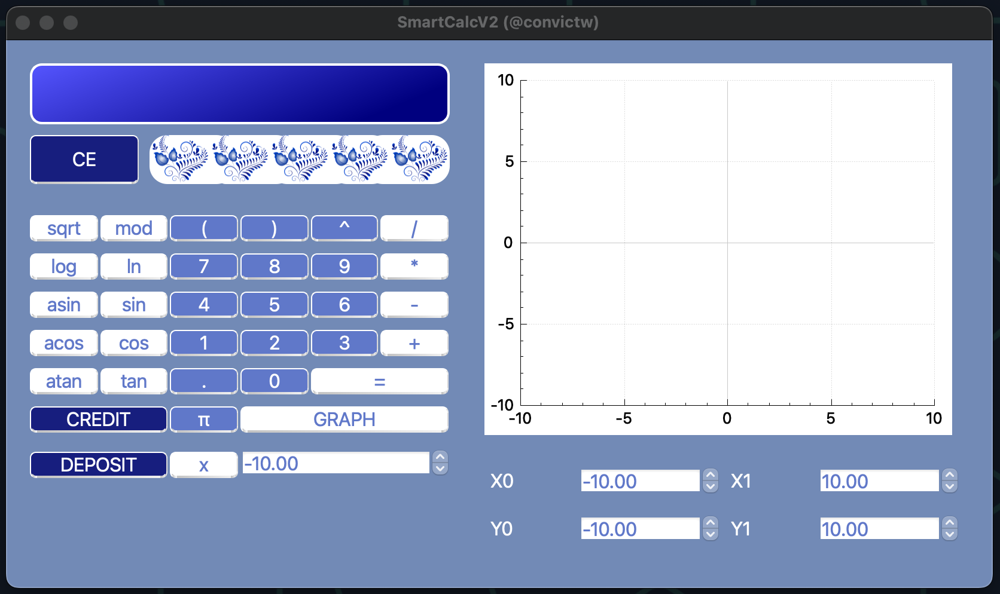
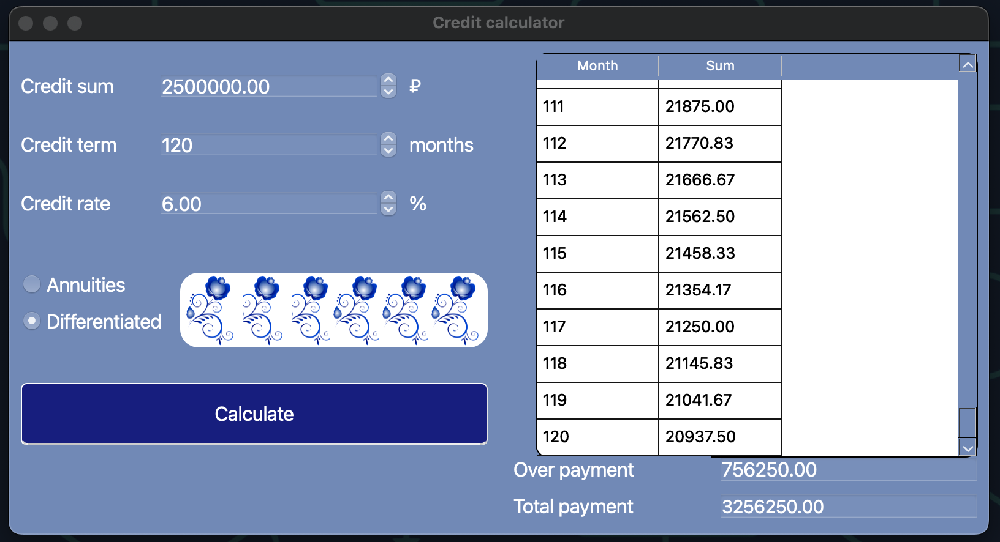
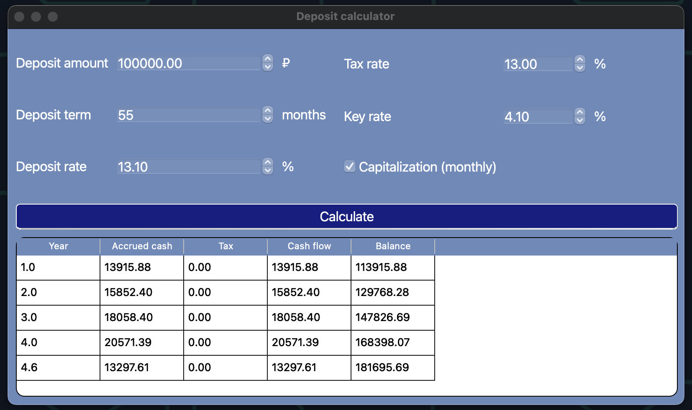

# SmartCalcV2

## Introduction

SmartCalcV2 is an extended version of the standard calculator in C++ using the object-oriented programming paradigm, applying MVC-pattern, implementing the same functions as the application previously developed in the [SmartCalc](https://github.com/irunazushan/irunazushan.github.io/tree/main/Projects/SmartCalc) project.

## MVC pattern scheme


## The interface of the SmartCalc

The calculator accepts an expression from the user, and after pressing on button 'Enter' or '=' it outputs the result. It is possible to draw a graph, select a range of the coordinate plane, and manipulate the graph using the cursor. The calculator's design is made in the style of Russian folk painting - gzhel



## Function Plotting
The calculator provides the ability to plot functions. The function plotting feature of the calculator allows you to visually understand mathematical equations by plotting their graphs. This makes it easier to analyze and work with various functions.


    Cos(x) plotting

## Special Modes of Operation
The calculator has two special modes of operation:
- Credit calculator 
- Deposit calculator 

### Credit Calculator 
The credit calculator is a helpful tool for determining monthly payments and interest rates on credit purchases. It is useful for individuals looking to manage their finances and plan their budget effectively.




    The interface of the credit calculator

- Input: total credit amount, term, interest rate, type (annuity, differentiated)
- Output: monthly payment, overpayment on credit, total payment

### Deposit Calculator 
The deposit calculator is great for calculating interest on deposits and helping you make informed financial decisions. Whether you're saving for a big purchase or just looking to grow your savings, this tool can help you crunch the numbers and see how your money can grow over time.



    The interface of the deposit calculator

- Input: deposit amount, deposit term, interest rate, tax rate, key rate, capitalization of interest
- Output: accrued interest, tax amount, deposit amount by the end of the term

## Development Details
- The calculator has been developed using the C++ language of C++17 standard  and the QT Creator version 6.2.
- The program is built with Makefile which contains standard set of targets for GNU-programs: all, install, uninstall, clean, dvi, dist, test, gcov_report.
- The calculation is done after you complete entering the calculating expression and press the = symbol or press "Enter" putton.
- Users are able to enter up to 255 characters


## Installation

```
git clone git@github.com:irunazushan/irunazushan.github.io.git
cd Projects/SmartCalcV2/src
make install
```
